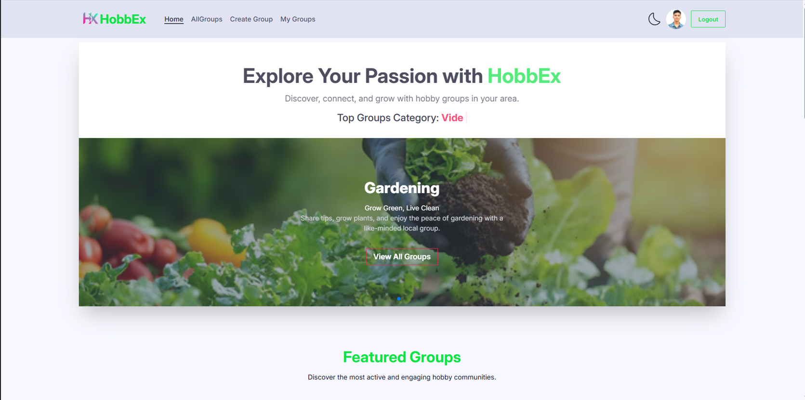

# 🎨 HobbEx - A Local Hobby Group Organizer

**HobbEx** is a responsive web application that helps users **discover, create, and join local hobby groups** such as painting circles, reading clubs, or hiking crews. The platform fosters community engagement based on shared passions and hobbies.

---



---

## 🔗 Live Preview & Repositories

- 🌐 **Live Site:** [https://hobbex-c8104.web.app/](https://hobbex-c8104.web.app/)
- 🛠️ **Server Repo:** [https://github.com/Programming-Hero-Web-Course4/b11a10-server-side-nurislam243](https://github.com/Programming-Hero-Web-Course4/b11a10-server-side-nurislam243)

---


## 📌 About the Project

HobbEx enables users to:
- Find and explore hobby groups.
- Create their own hobby group.
- Join groups that match their interests.
- Manage their created groups.

All group data is stored in a secure backend using MongoDB, and the UI is built using React with modern UI libraries to ensure interactivity, speed, and responsiveness.

---

## 🚀 Key Features

### 🔐 Authentication & Authorization
- Email & password login (with password validation).
- Google Sign-In with Firebase Authentication.
- Private routes protected using custom route guard (`PrivateRoute`).
- Authenticated users only can create, update, or join groups.

### 🎯 Group Management
- Create, update, and delete hobby groups.
- Past-date groups cannot be joined.
- “My Groups” page shows only the groups created by the logged-in user.

### 📱 Responsive & Accessible UI
- 100% mobile-first responsive design.
- Light/Dark theme toggle with state persistence.
- Clean and unique design (not copied from example).

### 🛠️ Technologies & Libraries Used

#### ✅ Core Stack:
- **React.js**
- **React Router DOM**
- **Firebase Authentication**
- **Express.js** (Backend)
- **MongoDB** (Database)
- **Tailwind CSS** + **DaisyUI**

#### ✨ UI & UX Enhancements:
- `Swiper JS` – Responsive sliders
- `Lottie React` – Engaging animations
- `React Awesome Reveal` – Entrance animations
- `React Simple Typewriter` – Typewriter effects
- `React Tooltip` – Hover-based tooltips
- `React Icons` – Icon support
- `SweetAlert2` – Beautiful confirmation/alert popups
- `React Toastify` – Toast notifications
- `React Helmet` – Dynamic document titles

#### 🧰 Utilities:
- `date-fns` – For date formatting and comparisons

#### 🚀 Deployment:
- **Client:** Firebase Hosting
- **Server:** Vercel

---

## 🧭 Routing Overview (with Access Control)

| Route                 | Component         | Access     | Loader (if any)                       |
|----------------------|------------------|------------|---------------------------------------|
| `/`                  | Home             | Public     | ✅ All groups                          |
| `/groups`            | AllGroups        | Public     | ✅ All groups                          |
| `/group/:id`         | GroupDetails     | Private    | ✅ Single group                        |
| `/createGroup`       | CreateGroup      | Private    | ❌ No loader                           |
| `/myGroups`          | MyGroups         | Private    | ✅ Filtered user groups                |
| `/updateGroup/:id`   | UpdateGroup      | Private    | ✅ Single group                        |
| `/login`             | Login            | Public     | ❌                                     |
| `/registration`      | Register         | Public     | ❌                                     |
| `*` (Not Found)      | NotFound         | Public     | ❌                                     |

---

## ✅ Functional Pages Summary

| Page             | Path                 | Access Type |
|------------------|----------------------|-------------|
| Home             | `/`                  | Public      |
| All Groups       | `/groups`            | Public      |
| Group Details    | `/group/:id`         | Private     |
| Create Group     | `/createGroup`       | Private     |
| My Groups        | `/myGroups`          | Private     |
| Update Group     | `/updateGroup/:id`   | Private     |
| Login            | `/login`             | Public      |
| Register         | `/registration`      | Public      |
| Not Found (404)  | `*`                  | Public      |

---

## 🧩 Folder Structure

```bash
src/
├── assets/             # Static assets (images, lottie files)
├── components/         # Navbar, Footer, Route Guards, etc.
├── firebase/           # Firebase config & initialization
├── hooks/              # Custom hooks (e.g., useAuth)
├── layouts/            # Root layout (outlet setup)
├── Components/
├── pages/
│   ├── Home/
│   ├── Groups/         # AllGroups, GroupDetails, MyGroups
│   ├── CreateGroup/
│   ├── UpdateGroup/
│   ├── Login/
│   ├── Register/
│   ├── NotFound/
├── routes/             # React Router setup (createBrowserRouter)
├── ui/                 # UI components like Spinner, Loader
├── utils/              # Helper utilities (toasts, validators)
└── main.jsx            # Root app initialization


## 🛠️ How to Run HobbEx Locally

### 🔧 Prerequisites
Make sure you have the following installed:
- Node.js (v16 or above)
- npm or yarn
- Git
- MongoDB (Local or Cloud)
- Firebase project (for authentication)

---

### 📁 Clone Repositories, Install Dependencies & Run

```bash
# Clone Client
git clone https://github.com/your-username/hobbex-client.git
cd hobbex-client
npm install

# Create .env file in hobbex-client with the following:
# (replace with your actual Firebase credentials)
VITE_apiKey=your_api_key
VITE_authDomain=your_auth_domain
VITE_projectId=your_project_id
VITE_storageBucket=your_storage_bucket
VITE_messagingSenderId=your_sender_id
VITE_appId=your_app_id

# Start Client
npm run dev


# Open new terminal and clone Server
git clone https://github.com/your-username/hobbex-server.git
cd hobbex-server
npm install


